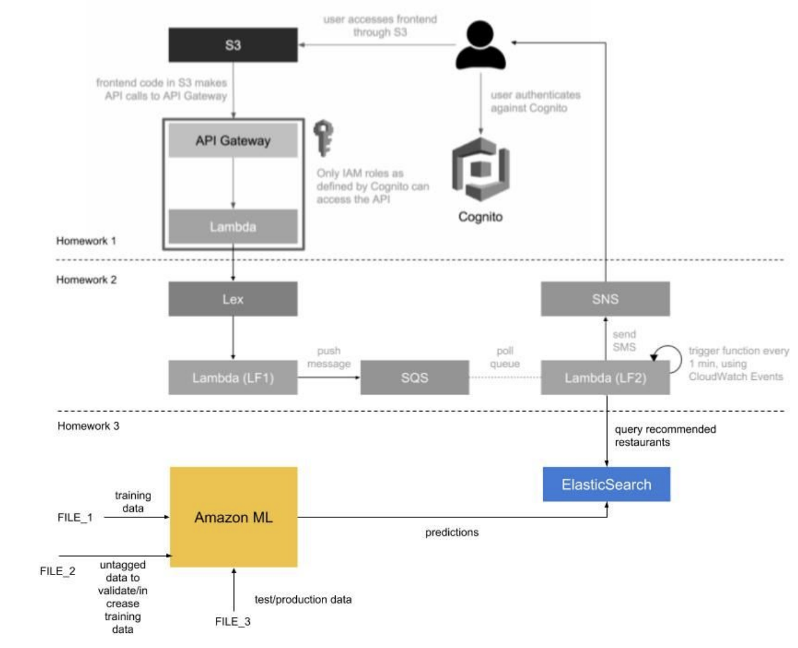

# AIChatRobot
Current implementing, will not update codes until summer for personal private reasons.
Work in Cloud Computing Group.
NYU Tandon school Computer Science Program


# Website enter:(first time is slow, refresh the web after you log in)(Sign up before log in )     
http://bot-website-bucket.s3-website-us-east-1.amazonaws.com


## First step
design simple dialog and front-end web:
with simple lambda function

### Architecture Diagram


### Below are several key points. 
1. Some implementations of the application features are slightly different from what TA recommended in the announcement. Firstly, I use implicit grant instead of authorization code grant. Also, to work around the fact that cognito only allows https callback, I actually created an api gateway http proxy to route the request back to the s3 bucket. 

2. Currently our application does not have sign out feature. Also, the user has to sign in first to use the chatbot.

3. The main client side logic is in index.html and js/index.js. Also, I added a lot of comments in js/index.js to help reader understand our code. Please pay extra attention to the comments since it is really helpful. 
### Function implemented
1.when you greet(morning or hi), it responses with "hi" back;

2.when you ask, it responses with simple answer;

3.when you say something it doesn't understand, it will responsed error;

### sample of core code logic:
```
    public BotResponse handleRequest(BotRequest request, Context context) {
    		List<Message> messages = request.getMessages();
    		Message m = messages.get(0);
    		UnstructuredMessage u = m.getUnstructured();
    		String text = u.getText();
    		String rText = "Sorry, I do not understand you"; 
    		context.getLogger().log(text);
    		switch(text) {
    		case "hello":case "Hello":case "hi":
    			rText = "Hi, nice to meet you";
    			break;
    		case "what is your name":
    			rText = "I am nobody";
    			break;
    		case "good morning":
    			rText = "Thanks!";
    			break;
    		default:
    			break;
    		}
    		
    		UnstructuredMessage ru = new UnstructuredMessage().text(rText);
    		Message rm = new Message().unstructured(ru);
    		List<Message> rMessages = new ArrayList<Message>();
    		rMessages.add(rm);
    		
        return new BotResponse().messages(rMessages);
    }
  ```

## Second step:
design a Dining Concierge chatbot using Amazon Lex  

### Architecture Diagram

### design a Dining Concierge chatbot using Amazon Lex. 
1.	Build a Dining Concierge chatbot using Amazon Lex.  
	a.	Create a new bot using the Amazon Lex service. Documents: https://docs.aws.amazon.com/lex/latest/dg/getting-started.html  
	b.	Create a Lambda function (LF1), which essentially entails the invocation of Lambda before Lex responds to requests -- this gives the chance to manipulate and validate parameters as well as format the bot’s responses. More documentation: https://docs.aws.amazon.com/lex/latest/dg/using-lambda.html  	**————————————————————validation——————————————————**  
		&emsp;●	Location   
		&emsp;&emsp; Use a USA city Set to valid the location.   
		&emsp;●	Cuisine    
		&emsp;&emsp;  Use a Cuisine Set to valid the cuisine.    
		&emsp;●	Dining Time    
		&emsp;&emsp;  Use regular expression to valid the dining time;    
		
		
		for MM/DD/YY HR:00 format
		var exp = /^(([0]?[1-9]|1[0-2])\/([0-2]?[0-9]|3[0-1])\/[1-2]\d{3}) (20|21|22|23|[0-1]?\d{1}):([0-5]?\d{1})$/;
		for 00:00 format
		var exp = /^(20|21|22|23|[0-1]?\d{1}):([0-5]?\d{1})$/;
		
		
	&emsp;●	Number of people   
		&emsp;&emsp;  Just make sure the (int)'number' >= 1;   
		&emsp;●	Phone number    
		&emsp;&emsp;  Use regular expression to valid    
		  
		
		phonenumber begin with + (area code)
		var exp = /^\+1\d{10}$/;
		
	c.	Bot Requirements:  
		&emsp;i.	Implement the following three intents:  
		&emsp; ●	GreetingIntent  
		&emsp; ●	ThankYouIntent  
		&emsp; ●	DiningSuggestionsIntent  
		&emsp;ii. The implementation of an intent entails its setup in Amazon Lex as well as handling its response in the Lambda function code hook.  
		&emsp;iii.	For DiningSuggestionsIntent, collect information from the user
2.	Build a suggestions module, that is decoupled from the Lex chatbot.  
	a.	During the fulfillment step https://docs.aws.amazon.com/lex/latest/dg/API_FulfillmentActivity.html of the DiningSuggestionsIntent, push the information collected from the user (location, cuisine, etc.) to an SQS queue. More on SQS queues here: https://aws.amazon.com/sqs/  
	b.	Create a new Lambda function (LF2) that acts as a queue worker. Functions:       
		&emsp;1. pulls a message from the SQS queue,  
		&emsp;2. gets restaurant suggestions based on its parameters using one or more APIs such as Yelp or Google Places,   
		&emsp;3. formats them      
		&emsp;4. sends them over text message to the phone number included in the SQS message, using SNS (https://docs.aws.amazon.com/sns/latest/dg/SMSMessages.html).  
	c.	Set up a CloudWatch event trigger that runs every minute and invokes the Lambda function as a result: https://docs.aws.amazon.com/AmazonCloudWatch/latest/events/RunLambdaSchedule.html. This automates the queue worker Lambda to poll and process suggestion requests on its own.  
3.	Integrate the Lex chatbot into your chat API from Step 1.  
	a.	Use the AWS SDK to call Lex chatbot from the Lambda function in 1st Step.
	b.	When the API receives a request, then          
		&emsp;1. extract the text message from the API request,  
		&emsp;2. send it to your Lex chatbot,   
		&emsp;3. wait for the response,  
		&emsp;4. send back the response from Lex as the API response.  
	c.	leverage the frontend from Step 1, with no additional modifications.  
	
### Tricky:

1. How to validate the slot value:
	It's hard to get the slot name which users are currently texting.    
	For example:   
	"where do you live in" " New York"   
	How to get to know slot[city] is current one?   ***Not fixed perfectly***

	**Method:(Hope improved ones)**  
	Every time user put in any value, I validate all values users have already put.

2. Bug: when input is 11:00, lex will not recognize the time

	**Method**    
	See from the documents "This time is ambiguous. It means either 10:00 AM or 10:00 PM. In this case, the value in the slots map is null"    

	*Use regular expression to let user add "AM/PM"*  
	
	
### Pictures of the Step2 result:


## Step 3: A restaurant recommendation engine
### Architecture Diagram



### Outline of the steps: 					
For this assignment, you have to complete and/or implement the following tasks：  
1. Use the Yelp API to collect 10,000 random restaurants from Manhattan.   
○ Use the following tools:  							
		■ Yelp API  				
			■ Get restaurants  
		■ DynamoDB (a noSQL database)  			■ Name the table “yelp-restaurants”   			■ Store the restaurants you scrape, as unstructured data (one thing you will notice is that some restaurants might have more or less fields than others, which makes DynamoDB ideal for storing this data)   			■ With each item you store, make sure to attach a key to the object named “insertedAtTimestamp” with the value of the time and date of when you inserted the particular record  
		■ Note: you can perform this scraping from your computer or from your AWS account -- your pick.			＜/br＞
		
		
2. Pick 100 restaurants that you like from the 10,000 you scraped at Step 1. 
	○ For each restaurant that you find, log the following information (ex. store it in a spreadsheet/CSV file) 				
		■ RestaurantId  
		■ Cuisine 			
			■ Ex. “Japanese” 			
		■ Rating 			
			■ Ex. 4.3 			
		■ NumberOfReviews 			
			■ Ex. 537 			
		■ Neighborhood 			
			■ Ex. “Soho” 			
		■ Recommended (this is binary value: 0/1. Set it to 1 here for restaurants you like and would like to recommend) 				
			■ 1 (this value is important, it signifies that you would recommend this restaurant)		


3. Pick 100 restaurants that you do NOT like from the 10,000 you scraped at Step 1. 
	○ For each restaurant that you find, log the following information (ex. store it in a spreadsheet) 
		■ RestaurantId 				
		■ Cuisine 
		■ Ex. “Japanese” 
		■ Rating 
		■ Ex. 4.3 
		■ NumberOfReviews 
		■ Ex. 537 
		■ Neighborhood 
		■ Ex. “Soho” 
		■ Recommended (this is binary value: 0/1. Set it to 0 here for restaurants you don’t like and wouldn’t recommend) 
		■ 0 (this value is important, it signifies that you would NOT recommend this restaurant)

4. Compile the data you put together in steps 2 and 3 into a CSV file (FILE_1). ○ Your file should have a format similar to the following: RestaurantId,Cuisine,Rating,NumberOfReviews,Neighborhood,Recomme nded “ABC123”,”Italian”,4.3,534,”Soho”,1 “DEF456”,”French”,3.75,21,”Hell’s Kitchen”,0 … 

5. Use Amazon ML to build a restaurant prediction engine ○ Upload the CSV (FILE_1) from step 4 above, as the ground truth of the model. These 200 (100 with recommended column value as 1 and 100 with recommended column value as 0) restaurants will form the initial set of training data for your model. ○ Download and convert the DynamoDB restaurant data (10,000 restaurants’ information - the 200 restaurants that form your training data) into a file (FILE_2) with the same CSV format as the file (FILE_1) from step 4. Make sure to filter out those 200 restaurants as your test/validation set should be different from your training data set. ○ Run the model against FILE_2 and see what restaurants the model predicted for you. You can conceptualise your prediction engine/ML model to be such that it received restaurant information
(RestaurantId,Cuisine,Rating,NumberOfReviews,Neighborhood) as input features and outputs/predicts ‘recommended’ column’s value. ■ Add more training data to FILE_1 as you see fit until you’re satisfied with the predictions. You can use restaurants from FILE_2, set their ‘recommended’ value (0/1) as you did in steps 2 and 3, to augment your training data. 
6. Once you are satisfied with the results of your ML prediction engine, request the larger Yelp data set (FILE_3) from the TAs (make a private piazza post to Instructors) and run the model against this data set. You can consider this data to be the one in production on which your model is used in real life scenarios. ○ We will also include a fourth file (FILE_4), that has the same restaurants as in FILE_3, but with the complete set of metadata. ○ Make sure to upload FILE_4 contents to DynamoDB. 
7. Create an ElasticSearch cluster using the AWS ElasticSearch Service. ○ Create an ElasticSearch index called “predictions” ○ Create an ElasticSearch type under the index “predictions” called “Prediction” ○ Store the prediction results from step 6 in ElasticSearch under the “predictions” index, where each prediction has a “Prediction” data type. This data type will be of composite type stored as JSON in ElasticSearch. https://www.elastic.co/guide/en/elasticsearch/guide/current/mapping.html
8. Update your Lex chatbot (LF2 restaurant suggestion function) from assignment 2, to query ElasticSearch for recommended restaurants. ○ Use the DynamoDB table “yelp-restaurants” (which you created from FILE_4 ) to fetch more information about restaurants (such as restaurant name, address, etc.), since the restaurant predictions from your model will have only a small subset of fields from each restaurant.


