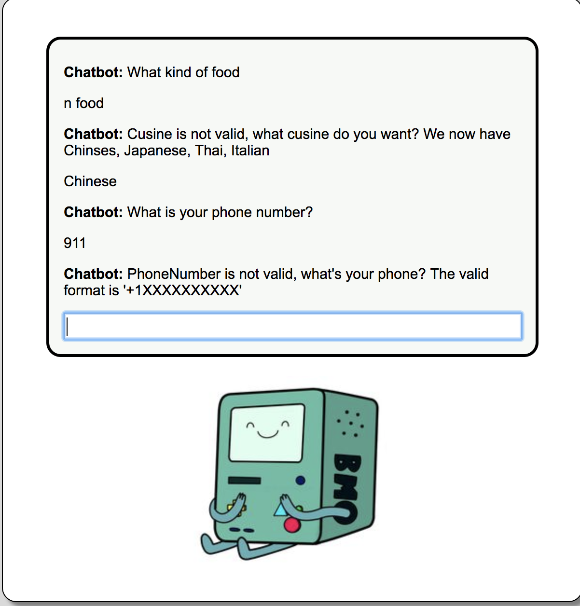
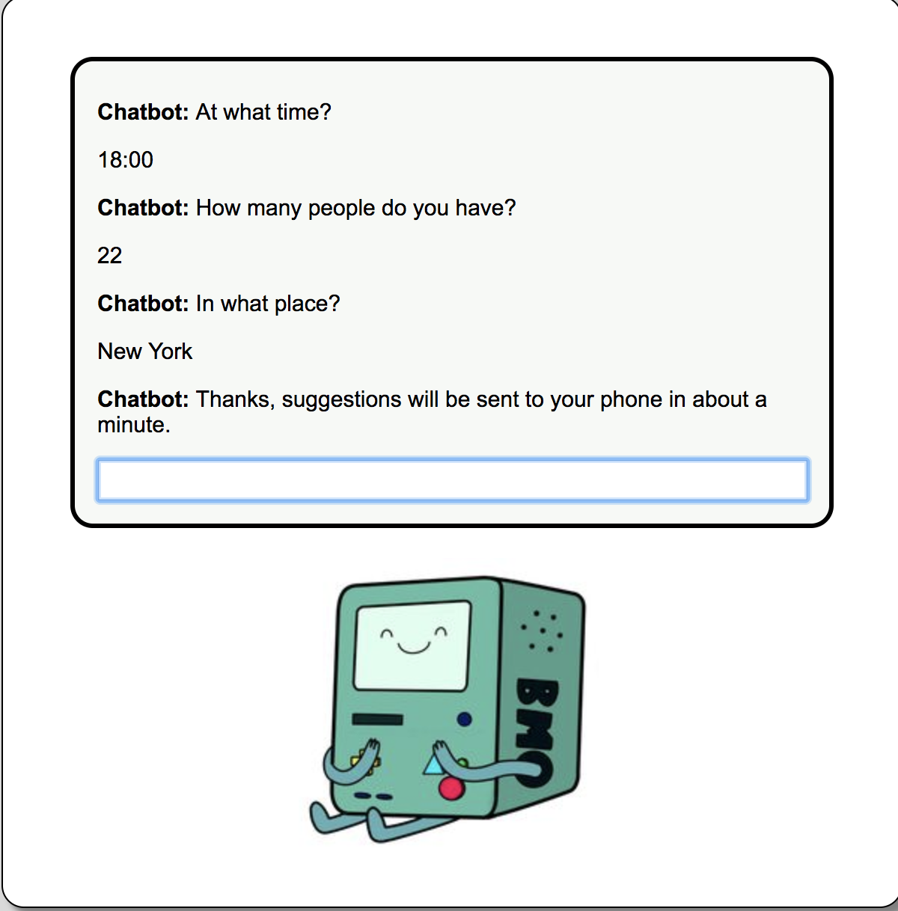

# AIChatRobot
Current implementing, will not update codes until summer for personal private reasons.
Work in Cloud Computing Group.
NYU Tandon school Computer Science Program

# Website enter:(first time dialog is slow, so refresh the web after you log in)
http://bot-website-bucket.s3-website-us-east-1.amazonaws.com

## First step
design simple dialog and front-end web:
with simple lambda function

### Architecture Diagram

### Below are several key points. 
1. Some implementations of the application features are slightly different from what TA recommended in the announcement. Firstly, I use implicit grant instead of authorization code grant. Also, to work around the fact that cognito only allows https callback, I actually created an api gateway http proxy to route the request back to the s3 bucket. 

2. Currently our application does not have sign out feature. Also, the user has to sign in first to use the chatbot.

3. The main client side logic is in index.html and js/index.js. Also, I added a lot of comments in js/index.js to help reader understand our code. Please pay extra attention to the comments since it is really helpful. 
### Function implemented
1.when you greet(morning or hi), it responses with "hi" back;

2.when you ask, it responses with simple answer;

3.when you say something it doesn't understand, it will responsed error;

## Second step:
design a Dining Concierge chatbot using Amazon Lex  

### Architecture Diagram

### design a Dining Concierge chatbot using Amazon Lex. 
1.	Build a Dining Concierge chatbot using Amazon Lex.  
	a.	Create a new bot using the Amazon Lex service. Documents: https://docs.aws.amazon.com/lex/latest/dg/getting-started.html  
	b.	Create a Lambda function (LF1), which essentially entails the invocation of Lambda before Lex responds to requests -- this gives the chance to manipulate and validate parameters as well as format the bot’s responses. More documentation: https://docs.aws.amazon.com/lex/latest/dg/using-lambda.html  	**————————————————————validation——————————————————**  
		&emsp;●	Location   
		&emsp;&emsp; Use a USA city Set to valid the location.   
		&emsp;●	Cuisine    
		&emsp;&emsp;  Use a Cuisine Set to valid the cuisine.    
		&emsp;●	Dining Time    
		&emsp;&emsp;  Use regular expression to valid the dining time;    
		
		
		for MM/DD/YY HR:00 format
		var exp = /^(([0]?[1-9]|1[0-2])\/([0-2]?[0-9]|3[0-1])\/[1-2]\d{3}) (20|21|22|23|[0-1]?\d{1}):([0-5]?\d{1})$/;
		for 00:00 format
		var exp = /^(20|21|22|23|[0-1]?\d{1}):([0-5]?\d{1})$/;
		
		
	&emsp;●	Number of people   
		&emsp;&emsp;  Just make sure the (int)'number' >= 1;   
		&emsp;●	Phone number    
		&emsp;&emsp;  Use regular expression to valid    
		  
		
		phonenumber begin with + (area code)
		var exp = /^\+1\d{10}$/;
		
	c.	Bot Requirements:  
		&emsp;i.	Implement the following three intents:  
		&emsp; ●	GreetingIntent  
		&emsp; ●	ThankYouIntent  
		&emsp; ●	DiningSuggestionsIntent  
		&emsp;ii. The implementation of an intent entails its setup in Amazon Lex as well as handling its response in the Lambda function code hook.  
		&emsp;iii.	For DiningSuggestionsIntent, collect information from the user
2.	Build a suggestions module, that is decoupled from the Lex chatbot.  
	a.	During the fulfillment step https://docs.aws.amazon.com/lex/latest/dg/API_FulfillmentActivity.html of the DiningSuggestionsIntent, push the information collected from the user (location, cuisine, etc.) to an SQS queue. More on SQS queues here: https://aws.amazon.com/sqs/  
	b.	Create a new Lambda function (LF2) that acts as a queue worker. Whenever it is invoked it   
		&emsp;1. pulls a message from the SQS queue,  
		&emsp;2. gets restaurant suggestions based on its parameters using one or more APIs such as Yelp or Google Places,   
		&emsp;3. formats them      
		&emsp;4. sends them over text message to the phone number included in the SQS message, using SNS (https://docs.aws.amazon.com/sns/latest/dg/SMSMessages.html).  
	c.	Set up a CloudWatch event trigger that runs every minute and invokes the Lambda function as a result: https://docs.aws.amazon.com/AmazonCloudWatch/latest/events/RunLambdaSchedule.html. This automates the queue worker Lambda to poll and process suggestion requests on its own.  
3.	Integrate the Lex chatbot into your chat API from Assignment 1.  
	a.	Use the AWS SDK to call Lex chatbot from the Lambda function in 1st Step.
	b.	When the API receives a request, you should   
		&emsp;1. extract the text message from the API request,  
		&emsp;2. send it to your Lex chatbot,   
		&emsp;3. wait for the response,  
		&emsp;4. send back the response from Lex as the API response.  
	c.	If you did everything correctly, you should be able to leverage the frontend from Step1, with no additional modifications.  
	
### Tricky:

1. How to validate the slot value:
	It's hard to get the slot name which users are currently texting.    
	For example:   
	"where do you live in" " New York"   
	How to get to know slot[city] is current one?   ***Not fixed perfectly***

	**Method:(Hope improved ones)**  
	Every time user put in any value, I validate all values users have already put.

2. Bug: when input is 11:00, lex will not recognize the time

	**Method**    
	See from the documents "This time is ambiguous. It means either 10:00 AM or 10:00 PM. In this case, the value in the slots map is null"    

	*Use regular expression to let user add "AM/PM"*  
	
	
### Pictures of the Step2 result:

